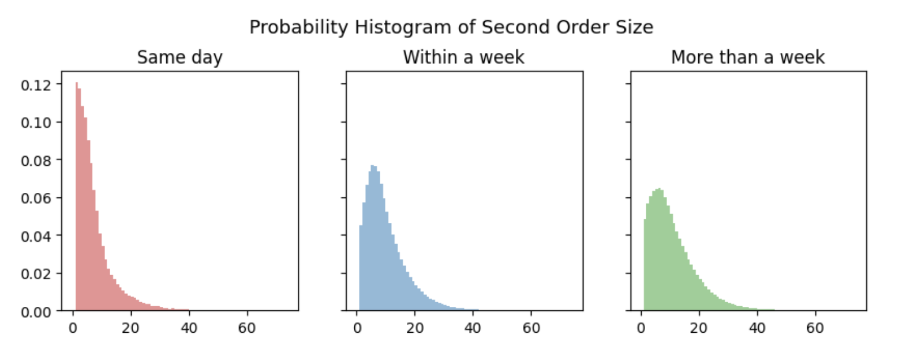

# Instacart Market Basket Analysis

### Table of Contents
* TOC
{:toc}

## Summary

## Data Preprocessing
The original datasets were obtained from Kaggle.There are five original datasets, which respectively contain information on order information, products purchased in each order, product information, department information and aisle information from Instacart, a grocery delivery service. 
  
During dataset joining, there seems to be a problem of mismatched numbers of rows between datasets, which may indicate many-to-one or duplicate issues. After investigating the unique values in datasets that contain department and aisle information, two departments and three aisles with repetitive ids and unreasonable names were dropped. It is more common to reach out to data providers when dealing with this kind of issue in practice, but here intuition works just fine since stores probably do not sell “illegal drugs” or “nuclear missiles”.
  
There are also some messy entries of aisle names. Necessary actions have been done to clean up these data.
<table>
  <tr>
    <th>Original</th>
    <th>Cleaned</th>
  </tr>
  <tr>
    <td>1_!ice68'_cream68'_toppings</td>
    <td>ice cream toppings</td>
  </tr>
  <tr>
    <td>10_!bakery68'_desserts</td>
    <td>bakery desserts</td>
  </tr>
</table>

Table 1: Example of Data Cleaning Process

  

## Exploratory Data Analysis 
### Customer Behavior 
There are approximately 200k users, 3.2 million orders and 50k unique product offerings according to the dataset. As is demonstrated in Figure 1, the number of orders per user has a negative exponential distribution. Around 29% of users placed orders 1-5 times, about 25% of users placed orders 6-10 times, and no more than 9% of users had ordered more than 40 times. There is a peak at 99 orders per user, which may indicate potential data issues.

<iframe src="assets/num_orders_per_user_1" width="100%" height=530  frameBorder=0></iframe>

Figure 1: Distribution of Number of Orders Per User

According to Figure 2,more than 34% of the orders are placed on day 0 and day 1, and about 72% of orders were placed during daytime hours (i.e. 9am to 5pm), which aligns with normal working hours.

Note: This analysis assumes that day 0 is Saturday and day 1 is Sunday given that people tend to shop for groceries more on weekends. Another point to note is that day 2 has the most orders among the rest of the days. Such a phenomenon supports the above assumption of days of weeks because intuitively people are likely to shop for what they’ve missed in weekend shopping on Monday. 

<iframe src="assets/dow_tod_heatmap_2" width="100%" height=530  frameBorder=0></iframe>

Figure 2: Heatmap of Order Volume by Time

As for the number of products per order, Figure 3 indicates that over 62% of orders contain no more than 10 products, and less than 10% of orders have more than 20 items.

<iframe src="assets/order_size_hist_3" width="100%" height=530  frameBorder=0></iframe>

Figure 3: Distribution of Order size

When looking closely at Figure 4, the distribution of the number of days customers placed their prior order, there seems to be a weekly user cycle since there’s a peak every seven days. There is a peak on day 30, which probably implies that the data maintainer aggregates any data larger than 30 into that bin. A follow up investigation is needed.

<iframe src="assets/day_since_prior_order_4" width="100%" height=530  frameBorder=0></iframe>

Figure 4: Distribution of Day Since Prior Order

When comparing the distribution of order size among orders with different days since prior order in Figure 5, there seem to be more smaller-sized second orders placed on the same day than larger-sized ones, which indicates that most people may forget a thing or two and reordered on the same day. Furthermore, the median order sizes of the second order on the same day, within a week and within more than a week respectively are 5, 8 and 9, which aligns with the common knowledge that people tend to buy more things when placing a second order after a longer time interval.

Figure 5: Probability Histogram of Second Order Size

### Products
As for individual products, the most ordered product is banana.The top 20 products with highest volume percentages are all from the `produce` and `dairy eggs` departments. Produce and vegetables expire much quicker than the other product offerings and are more commonly in everyday dishes/meals which aligns with what we might expect. Out of the top 20 products, 14 are Organic (~75%). With the trend of moving towards more natural and healthy foods this is a good opportunity for the company to look more into.

Among all the products, the most reordered ones are mostly food, drinks, and personal care items, which are the ones that get used up pretty quickly.

<table>
  <tr>
    <th style="text-align: center">Product Name</th>
    <th style="text-align: center">Volume Percentages</th>
    <th style="text-align: center">Reorder Rate</th>
  </tr>
  <tr>
  <td>Banana</td>
  <td style="text-align: right">    1.46%</td>
  <td style="text-align: right">    0.8435</td>
  </tr>
  <tr>
  <td>Bag of Organic Bananas</td>
  <td style="text-align: right">    1.17%</td>
  <td style="text-align: right">    0.8326</td>
  </tr>
  <tr>
  <td>Organic Strawberries</td>
  <td style="text-align: right">    0.82%</td>
  <td style="text-align: right">    0.7777</td>
  </tr>
  <tr>
  <td>Organic Baby Spinach</td>
  <td style="text-align: right">    0.75%</td>
  <td style="text-align: right">    0.7725</td>
  </tr>
  <tr>
  <td>Organic Hass Avocado</td>
  <td style="text-align: right">    0.66%</td>
  <td style="text-align: right">    0.7966</td>
  </tr>
  <tr>
  <td>Organic Avocado</td>
  <td style="text-align: right">    0.54%</td>
  <td style="text-align: right">    0.7581</td>
  </tr>
  <tr>
  <td>Large Lemon</td>
  <td style="text-align: right">    0.47%</td>
  <td style="text-align: right">    0.696</td>
  </tr>
  <tr>
  <td>Strawberries</td>
  <td style="text-align: right">    0.44%</td>
  <td style="text-align: right">    0.6982</td>
  </tr>
  <tr>
  <td>Limes</td>
  <td style="text-align: right">    0.43%</td>
  <td style="text-align: right">    0.681</td>
  </tr>
  <tr>
  <td>Organic Whole Milk</td>
  <td style="text-align: right">    0.43%</td>
  <td style="text-align: right">    0.8304</td>
  </tr>
  <tr>
  <td>Organic Raspberries</td>
  <td style="text-align: right">    0.42%</td>
  <td style="text-align: right">    0.7691</td>
  </tr>
  <tr>
  <td>Organic Yellow Onion</td>
  <td style="text-align: right">    0.35%</td>
  <td style="text-align: right">    0.6971</td>
  </tr>
  <tr>
  <td>Organic Garlic</td>
  <td style="text-align: right">    0.33%</td>
  <td style="text-align: right">    0.6801</td>
  </tr>
  <tr>
  <td>Organic Zucchini</td>
  <td style="text-align: right">    0.32%</td>
  <td style="text-align: right">    0.6884</td>
  </tr>
  <tr>
  <td>Organic Blueberries</td>
  <td style="text-align: right">    0.31%</td>
  <td style="text-align: right">    0.6288</td>
  </tr>
  <tr>
  <td>Cucumber Kirby</td>
  <td style="text-align: right">    0.3%</td>
  <td style="text-align: right">    0.6917</td>
  </tr>
  <tr>
  <td>Organic Fuji Apple</td>
  <td style="text-align: right">    0.27%</td>
  <td style="text-align: right">    0.7119</td>
  </tr>
  <tr>
  <td>Organic Lemon</td>
  <td style="text-align: right">    0.27%</td>
  <td style="text-align: right">    0.6899</td>
  </tr>
  <tr>
  <td>Apple Honeycrisp Organic</td>
  <td style="text-align: right">    0.26%</td>
  <td style="text-align: right">    0.7352</td>
  </tr>
  <tr>
  <td>Organic Grape Tomatoes</td>
  <td style="text-align: right">    0.26%</td>
  <td style="text-align: right">    0.6555</td>
  </tr>
</table>

Table 2: Top 20 Best Selling Products With Reorder Rates

<iframe src="assets/dept_reorder_6" width="100%" height=530  frameBorder=0></iframe>

Figure 6: Department Reorder Rates

<iframe src="assets/aisle_reorder_7" width="100%" height=530  frameBorder=0></iframe>

Figure 7: Aisle Reorder Rates

According to Figure 8, the department with the largest order volume is `produce`. The `other` category in the pie chart is made up of departments with less than 2% of total order volumes, which includes `personal care`, `babies`, `international`, `alcohol`, `pets`, `missing`, `other` and `bulk`. 

<iframe src="assets/order_dept_pie_8" width="100%" height=530  frameBorder=0></iframe>

Figure 8: Pie Chart of Order Volume Percentage By Department

According to Figure 9, the single aisle with the largest order volume is `fresh fruits`. The aisles that are not among the top 15 ones with most order volumes are compiled into the `other` category due to space limitations. 

<iframe src="assets/order_aisle_pie_9" width="100%" height=530  frameBorder=0></iframe>

Figure 9: Pie Chart of Order Volume Percentage By Aisle

<iframe src="assets/treemap_10" width="100%" height=530  frameBorder=0></iframe>

Figure 10: Treemap of Department and Aisles, sized by order volumes and colored by reorder rates

## Business Suggestions

## Future work

## Appendix
